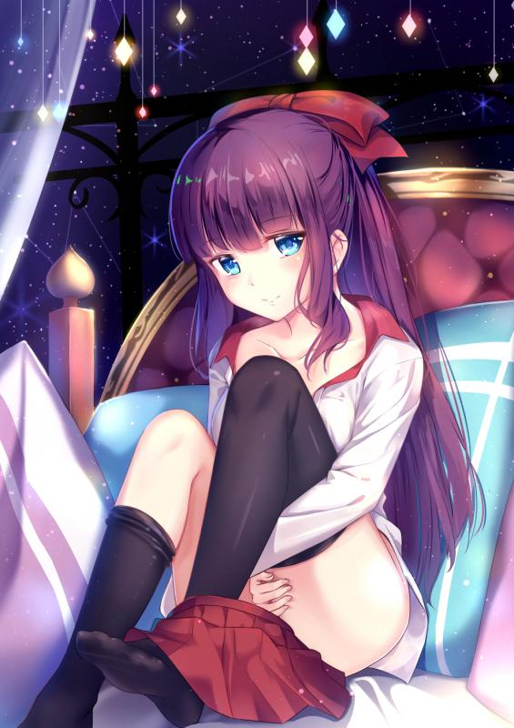
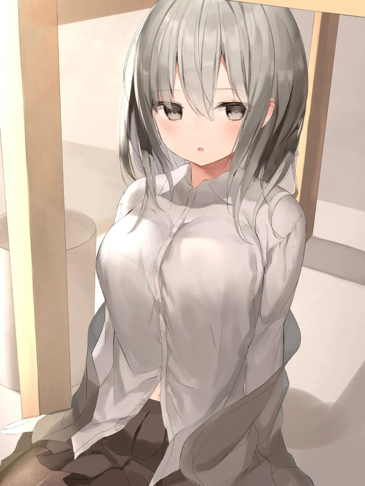
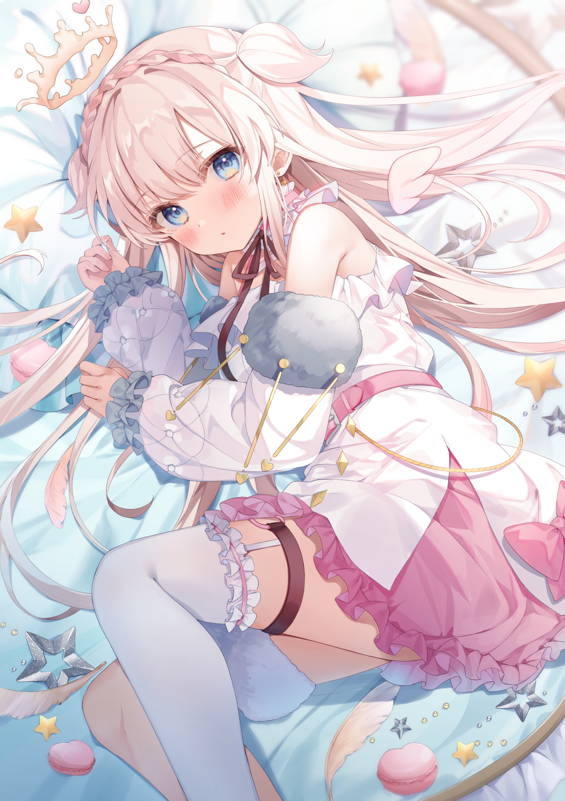
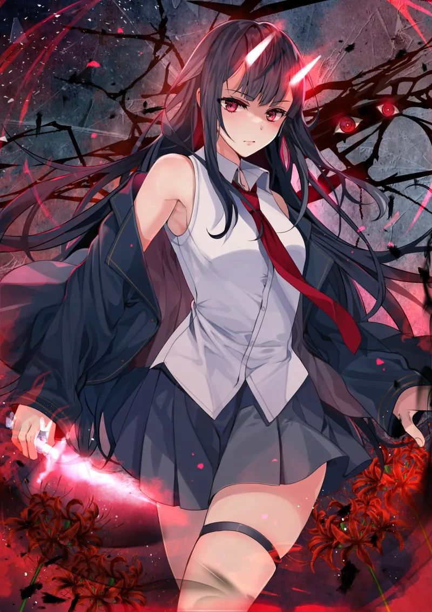
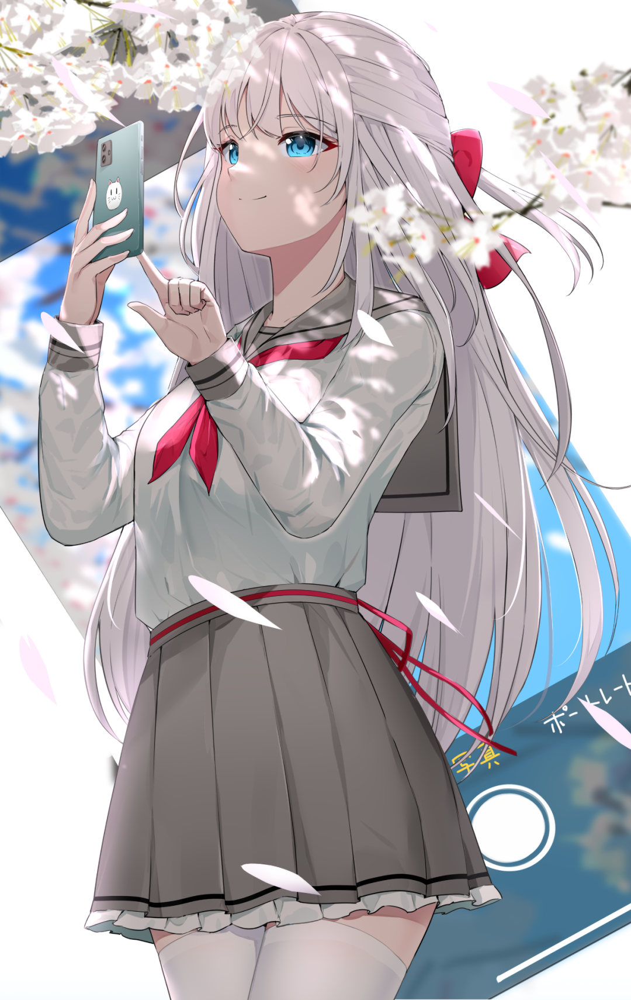

> 从今天开始我决定开始写自己的日记，可能不定时地更新自己的状态。
> 因为一段不堪回首的过往，我开始重新整理自己的所有，事业学业爱情一切从"零"开始，正面去面对他们，逃避不过是懦夫的行为。
>
> 用心去驾驭这些，随心而驰，此乃真正的逍遥。

哈哈，根据过往的经历，可能过段时间我就会忘记这个日记，也不知道我写到什么时候。

> 2021-4-3   心情微妙，老家网太差了。

要开始写论文了，打算今天就整理整理过去，然后整理整理论文的资料。

真惆怅啊，网络部分现在最大的弱点就是socket编程,linux的是shell编程，不过都是属于小块内容。
shell，socket，leetcode整理，算法整理
今天开始Leetcode复习，先从博客里的开始。
找出字符串中最长子字符串的长度，想用hash来做，但是似乎一直没想通

> 2021-4-4 清明节   

 家里同龄人就我一个回来烧纸。。。  跑了大半天快累死了，发现自己离不开电脑，这个有点危险啊，不能被电脑驾驭自己啊。和刚少下了几把棋，晚上准备继续写论文的初稿。
mmp我的sql server被我删了
数据库也要改进设计，不然就重了。
数据库设计：1.精简化(删除所有不必要的)  2.我要加入redis的设计结构  3.修改所有的字段并且能够驾驭索引的设计(可能的话重新设计索引)

> 2021-4-5 好迷茫啊，突然好无聊(其实还有一堆事情没弄)

突然发现我做的数据分析系统没有增删改的功能，这还能当个查询系统嘛，真的不想骂人。
当初这个.net走的真失败，浪费了大量的精力时间，还差点弄的身上留疤。
决定了系统走性能论文，之后设计一个redis缓存中间层，正好学习一个机制。

> 2021-4-6   今天去了车管所

今天接了两个面试，一个速游和淘米最终面
突然想到去年一年发生太多事了，对人生我也有了新的看法。
我将本我在世上是一种修行，模糊感觉到修的分别是人道与天道
将红尘看作一团迷雾的话，我认为真正的修行就是能够雾里来雾里去，那么心的修行就算是大成了。
改天有有时间，好好讲讲我现在所理解的人道与天道。

> 2021-4-8 这两天不知道怎么了，身体很不舒服

昨天没写日记，今天也就看了面经一天，然后下午面试结束。
接下来就是等面试结果，和其他面试通知了。
接下来这两天开始准备写论文初稿了。

> 2021-4-9  今天收到了淘米的offer，但是我很不爽

我也不知道这种不爽来自哪里，但是我很不爽。
第一件事：还是把其他面试给认真完成吧。正好也看看我的学习能力还能不能得到提高。
第二件事：我开始准备毕业旅行了。毕业旅行计划正式启动！！！
完蛋，没有特别想去的地方，有这个钱似乎能买台不错的电脑。。。。。。
明天开始调整作息，而且要开始看C++了。

> 2021-4-12 前两天没有更新，因为去亲戚家被要喝酒了

这两天都很不舒服，而且还要公司调研要做。
这两天似乎要犯了去年同样的错误，但是今年要找到了应对办法，希望有用。
既然选择了这条路，后悔已经没什么用了，而且就算回到过去，我想我还是会做出同样的选择。
如果一直停留在过去，那么未来的路是不会延长的，但是道理大家都懂，做起来很难。

> 2021-4-17  一眨眼就17号了，时间真快

这两天主要搞那个邮递烦死了。
今天突然想到自己的一个缺点，就是优柔寡断。这个习惯导致我失去了很多东西。
现在回想过去，自己那么徘徊不定似乎与自己的人生观有关系。因为对人生看的太深了，导致有太多的疑惑不解。这些使我有时候感觉迷茫不解，导致我习惯上的优柔寡断。

> 2021-4-19   好难受

今天老妈和我打电话了，说要买房子，我不知道我听到了是什么感受。
家里帮买房子，一般来说应该是要高兴的吧。
想到了父母在外面的辛苦，又想到了父母想要让我按照他们给的未来来走向未来。
老妈问我考上研究生又能怎么样？本事不是考研究生就能有的。你现在过的这么累干嘛。
我知道，我当然知道。
但是我的梦想是成为一个学者。
 我知道我的天赋比较差，我也知道我只要放弃这个梦想就能过的很舒服。
家里亲戚也说你爱它，但是它不爱你啊。
一个大男生的我突然好想哭，我没能做到一个哥哥的责任，没能做到一个儿子的责任。
去年我的事业爱情学业从都崩溃了。即使这样我遇见他人还要笑脸相迎，装作什么都无所谓的样子。
这个大学生涯我真的努力了，但是最后我却是我们宿舍最一事无成的人。
我既是一事无成的人，也没人觉得我能成功。
说实话，我觉得我也不是小说的主角，但是我只想做好现在的每一步。