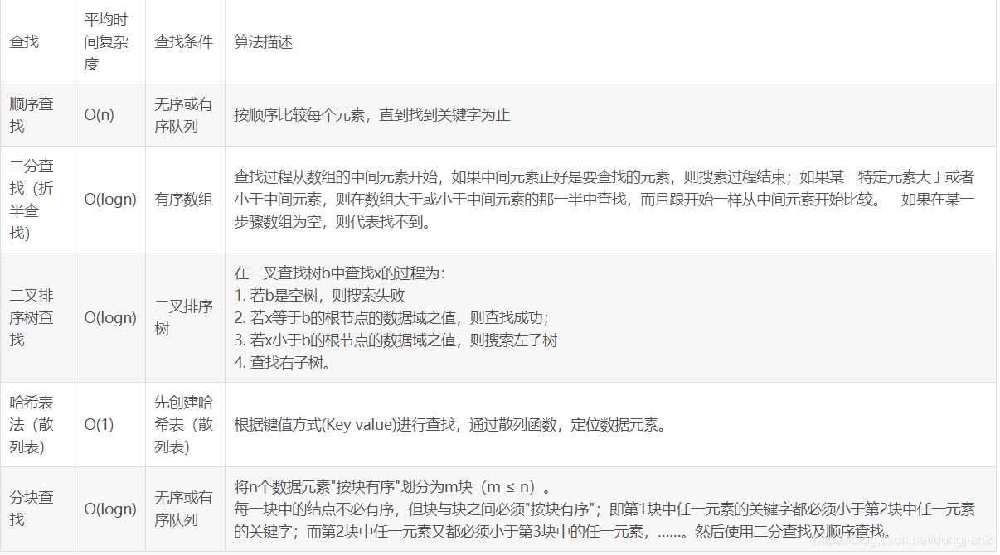
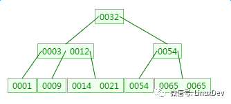
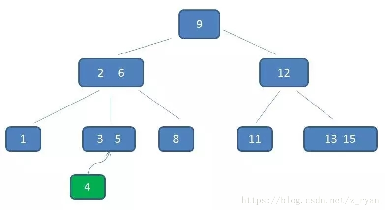
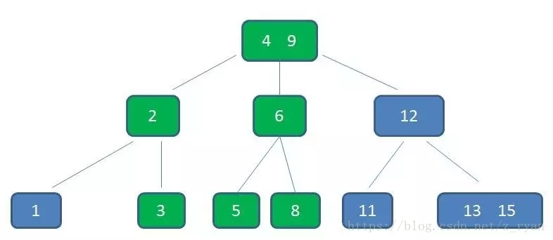
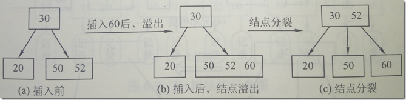

学习角度:基本思路，伪代码，查找长度，平均时间复杂度
二叉树每层最大结点数为2^（h-1）
查找最重点的就是折半查找
折半查找有自己判定树-二叉排序树(左小右大)
其特点有以下几个：
    只能对有序的顺序表进行查找。
    是一种静态查找。
    查找的平均时间复杂度为o（log2n）。
    成功平均查找长度ASL约(n+1)/n*log2（n+1）-1。足够大时近似log2（n+1）-1
5,16,20,27,30,36,44,55,60,67,71
计算平均查找长度：1/11(1+2*2+3*4+4*4) = 3

查找成功时比较次数最多为log2底n（向下取整） + 1(从判定树来判断是最简单的方法)

伪代码：

```go
	初始化
	int min =0;  //最小下标
	int max =arr.length-1;   //最大下标
	int mid = 0;  //中间下标
	while (min<max){
		//没找到,更新范围继续找
		mid = (min+max)/2;
		if (arr[mid]>number){ max = mid-1;  //number在mid的左边	 
		}else if(arr[mid]<number){  min = mid+1;  //改变最小下标//number在mid的右边
		}else{return  mid;}
	}
	return -1;
```
2、分块查找：O(log2n)~O(n)之间
树表的学习：
二叉排序树
1.左小右大
2.中序遍历是一个递增数列，算法题经常用到这个特点
伪代码：

```go
基本思路：1.如果节点为空则返回 2.与节点值对比：相同返回，大于递归右子树，小于递归左子树
func search(tree root,key int)Tree{//查找数值key
	if root == nil{return nil}
	if key == root.data{//对比
		return root
	}else{
		if key<root.data{return search(root.left)}
		if key>root.data(return search(root.right))
	}
}
```

分析：平均查找长度：取决于二叉排序树的形态，最优类似折半判定树与log2n成正比，最差是一条直线(n+1)/2
平均时间复杂度：取决于二叉排序树的形态，最优类似折半判定树o(log2n)，最差是一条直线0(n)
应用：经常插入删除和查找的采用二叉排序树比较好

平衡二叉树
1.左右子树的深度之差的绝对值不能超过1
2.平衡二叉树的重难点在于怎么调整平衡二叉树
3.按照二叉排序树处理，等不平衡时再调整平衡
四种基本调整方式;LL,RR,LR,RL这玩意这有直接看图，结合书上p207(严薇敏)

1、顺序查找：

###### （1）最好情况：要查找的第一个就是。时间复杂度为：O(1)

（2）最坏情况：最后一个是要查找的元素。时间复杂度未：O(n)
（3）平均情况下就是：（n+1）/2。
所以总的来说时间复杂度为：O(n)

3、插值查找：O(log(2)(log(2)n))->log以2为底的（log以2为底的n的对数）的对数
4、斐波那契查找：O(log2n)->log以2为底n的对数
5、树表查找：
（1）二叉树：O(log2n)~O(n)之间
（2）红黑树：O(lgn)
（3）B和B+树：O(log2n)
7、哈希查找：O(1)




对于数据库最重要的数据结构B树，B+树
他们与平衡二叉树同样，只不过变成了平衡多路树

为什么要提出B树？
我所了解的：内存向数据库提出查找，对于普通的平衡二叉树高度太高，导致磁盘IO次数太多，所以我们要使得二叉树变得矮胖

M阶B树的特性(每个节点最多M-1个关键字)：
根节点的子树至少有两个，最多M个，键值是M-1
非根节点非叶子节点的子树至少有M/2上溢，最多M个，键值是M-1
B树本身与平衡二叉树相同，平衡二叉树又与二叉排序树相同，所以B树是有序的，即左小右大

> B树的查询：
>
> 比如说内存有个数字是0014数字
> 1.第一次磁盘IO，拿取0032到内存进行对比
> 2.第二次磁盘IO，拿取0003，0012到内存对比
> 3.第三次磁盘IO，拿取0014对比成功
> 相对于普通二叉树对比次数没有降低，但是磁盘IO次数降低了，对比在内存速度极快
> 如果B树过高就是普通的二叉树了，如果过低就成了数组了




> B树的插入
>
> 插入分为两种情况：1.不分裂，即该节点关键字小于M-1，2.分裂，关键字等于M-1,加入进去，以中间关键字为界分裂，中间关键字往上提
> 重复上述工作，最坏情况一直分裂到根结点，建立一个新的根结点，整个B树增加一层。




例子2

> B+树
>
> https://www.sohu.com/a/156153437_186061
>
> http://www.liuzk.com/410.html
>
> 两篇文章介绍的很通俗

> 散列表
> 1.如何构建散列表
> 2.如何处理冲突

1.除留余数法：H(key) = key%p   p的选定不超过散列表表长m,p最好取质数
还有一些其他的方法比如折叠法等等，不会看起来像数学公式

2.处理冲突的方法
开放地址：线性探测法，二次探测法，伪随机探测法(这个没什么好讲的就是随机取一个)
链地址法：散列表中关键字发生冲突生成链表

对散列表的算法分析（计算）这个留着以后再看吧