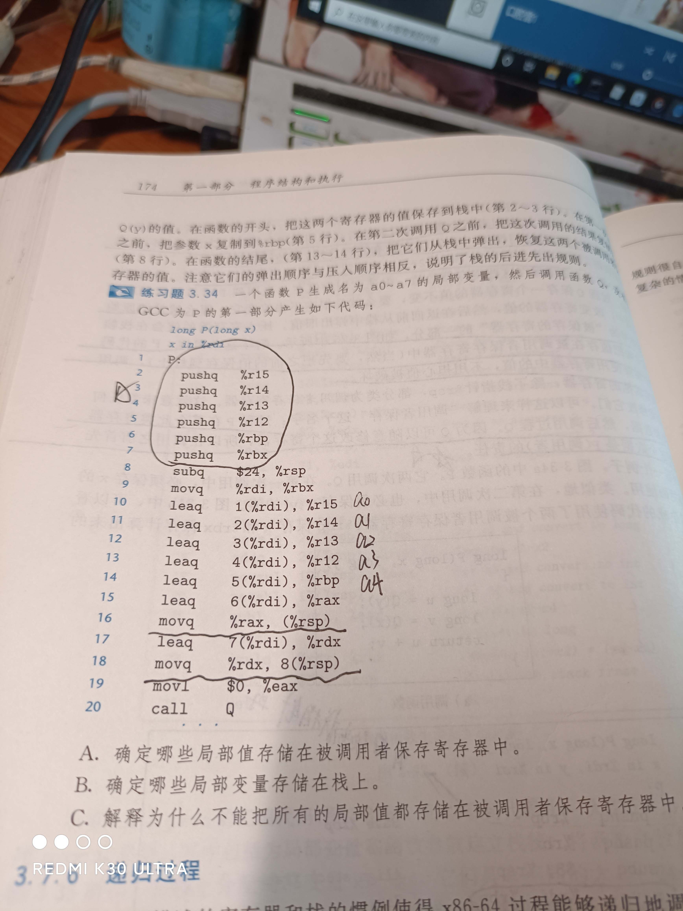

控制流(汇编)
条件
跳转

函数调用与栈的关系

```c++
在汇编中理解调用函数与栈的关系是一件很重要的事情
函数p调用函数r
粗俗理解：汇编中call指令是调用，call指令执行之后，会将返回地址压入栈中，PC计数器指向函数r的地址。
ret结束函数r，此时将返回地址从栈中弹出，找到了函数p执行的位置继续执行。
返回地址：执行断开的下一个执行地址。
```

# Amdahl定律

定律：对系统某个部分加速，对系统整体性能的影响取决于该部分的重要性和加速程度。


# 小/大端法机器表示

0x01234567这是左高右底
机器中表示：67  45  23  01
大端法：最高有效位在前面   01 23 45 67
小端法：最低有效位在前面   67 45 23 01

# 位向量的布尔运算

a :  0110  1001
b :  0101  0101
~a: 1001  0110
~b: 1010  1010
a^b:0011  1100(p:0,q:1或者p:1,q:0则为1)

# 第三章


3.7 x在%rax中,y在%rcx中，指明寄存器中%rdx的值

leaq 6(%rax),%rdx      6+x
leaq (%rax,%rcx),%rdx       x+y
leaq (%rax,%rcx,4),%rdx        x+4y
leaq 7(%rax,%rax,8),%rdx     7+9x
leaq  0xA(,%rcx,4)   %rdx       10+4y
leaq   9(%rax,%rcx,2) ,%rdx    9+x+2y

3.8省

orq 相除 sarq右位移 notq取补 subq相减


# 转移控制

转移控制很简单就在函数中调用另一个函数时发生的控制转移(使用栈来保存回来的地址)
但是有一个不明白的地方就是栈的地址有时候跳的很远。

# 传递参数(调函数)

函数P调用函数Q传参与Q结束返回参数都是使用寄存器来存放(书上有表对表查)，如果超过六个则使用栈来存放。
书上一个示例一个题目都举例子了

题目:3.33
*u += a
*v += a
return sizeof(a) + sizeof(b)
汇编:
movslq %edi,  %rdi
addq    %rdi,  (%rdx)
addb    %sil,  (%rcx)
movl   6,  %eax
确定4个参数的合法顺序以及类型，有两种正确答案

# 保存环境状态

函数P调用函数Q，1.将%rbp,%rbx,%r12到%r15保存到栈中(这个过程由Q管理所以叫被调用者保存寄存器),2.将函数P中的局部变量加载到以上寄存器中，如果寄存器不够那么存到栈中
练习题3.34


根据之前的过程，我们分为两个过程，第一从六个push代表将数据保存到栈中,第二部分找目标寄存器是被调用者保存寄存器，因为代表这些都是P函数要保存的数据,图中从%rbx到%rbp为a0a1a2a3a4a5，剩下的a6a7分别保存在(%rsp)即栈中。

答案:A：a0到a5保存在寄存器中。B：a6a7保存在栈中。C：因为寄存器数量不够实用，所以使用栈来保存。

有关数组指向的一些简单计算，两个画圈的可能要背一下


# 结构体与联合体

重点是联合体,联合体的优点就是节省空间，但是感觉不容易计算操作
练习题3.43
typedef union{
	struct{long u; short v; char w;}t1;
	struct{int a[2]; char *p;}t2;
}u_type;
针对表达式:
void  get(u_type  *up,  type  *dest){ *dest  == expr};

expr的各种表达式情况
up->t1.u                 long(8字节)                 movq  (%rdi),%rax    movq  %rax , (%rsi)
up->ti.v                  short (2)                      movq  8(%rdi),ax   movq %ax,(%rsi)
&up->ti.w               char *(8)                      addq   $10   %rdi     movq   %rdi  (%rsi)
up->t2.a                 int* * (8)                       movq %rdi    (%rsi)  将整个联合中看出两个区域，每次到了新区域都要重新分配空间
*up->t2.p               char (1)                       movq 8(%rdi),%^rax      movb   (%rax),%al;   movb  %al.(%rsi)  

# 缓冲区越界问题

# 浮点数

有关寄存器的分配问题，分为两个部分，即通用寄存器与浮点寄存器，按照顺序分配，通用rdi,rsi,rdx,rcx等，浮点xmm0,xmm1,xmm2等
练习题3.52
double g1(double  a,  long  b,  float  c, int  d);%xmm0,%rdi,%xmm1,%esi
double g4(float  a ,  int  *b  ,  float  c ,  double  d);%xmm0,  %rdi  ,  %xmm1  ,%xmm2

练习题3.53确定4个参数类型可能的组合|
double funct1(arg1_t   p,  arg2_t   q,   arg3_t   r,  arg4_t   s){
	return  p/(q+r)  -  s
}
编译产生的代码
funct1:
vcvtsi2ssq(int->float)    %rsi,  %xmm2 ,  %xmm2
vaddss(两个浮点数相加)    %xmm0,  %xmm2,  %xmm0
vcvtsi2ss(int_>float)     %edi,  %xmm2,  %xmm2
vdivss  %xmm0,  %xmm2,  %xmm0
vunpcklps    %xmm0,  %xmm0,  %xmm0
vcvtps2pd    %xmm0,%xmm0
vsubsd  %xmm1,  %xmm0,  %xmm0
ret


练习题3.54
double funct2(double  w,  int  x,  float  y ,  long  z);w int %xmm0;x in %edi;y  in %xmm1;  z  in  %rsi;
汇编代码
funct2:
vcvtsi2ss    %edi,  %xmm2,  %xmm2    #将int  x 转成float存入xmm2中
vmulss   %xmm1,  %xmm2,  %xmm1   #y = y*(float)x
vunpcklps   %xmm1,  %xmm1,  %xmm1   
vcvtpcklps    %xmm1,  %xmm2    #float形式的y*(float)x 转成double
vcvtsi2sdq    %rsi,   %xmm1,  %xmm1  #z转成double
vdivsd  %xmm1,  %xmm0,  %xmm0  #(double)z/w
vsubsd  %xmm0,   %xmm2, %xmm0  #(double)y*x -- (double)z/w
ret 

指令编码

Y86-64异常

Y86-64程序

一些Y86-64指令的详情

组合电路和HCL

Y86-64的顺序实现

# 指令序列的字节编码


```c
练习题4.1
irmovq  $15,%rbx
其中irmovq编码为30FrB,%rbx寄存器标识符为3,f为无寄存器
30f30f00000000000000,
15~f前面补零,  00 00 00 00 00 00 00 0f倒过来0f 00 00 00 00 00 00 00

rrmovq %rbx , %rcx
rrmovq~20,%rbx~3,%rcx~1,2031

rmmovq %rcx,-3(%rbx)
rmmovq~40,%rcx~1,%rbx~3,4013fdffffffffffffff
-3~1000 0011求补码1111  1101为fd
addq   %rbx,%rcx
addq~60,%rbx~3,%rcx~1,6031

```

# Y86-64程序

```
这一部分主要X86与Y86的区别
```

# 在X86有关%rsp的歧义

```c
压入pushq行为的歧义
movq  %rsp , %rax
pushq  %rsp//歧义：1.减8压入，2.压入之后减8
popq  %rdx
subq  %rdx, %rax
ret
返回0，是因为压入的值与弹出的值一样
弹出popq行为的歧义
movq  %rsp , %rdi
pushq  $0xabcd
popq  %rsp//重点：%rsp得到的值是弹出的数值, 等价(%rsp) , %rsp
movq  %rsp, %rax
movq  %rdi, %rsp
ret
返回0xabcd, 
```


# 虚拟内存

> ## 地址翻译

根据给出虚拟地址寻找物理地址(通过页表)
