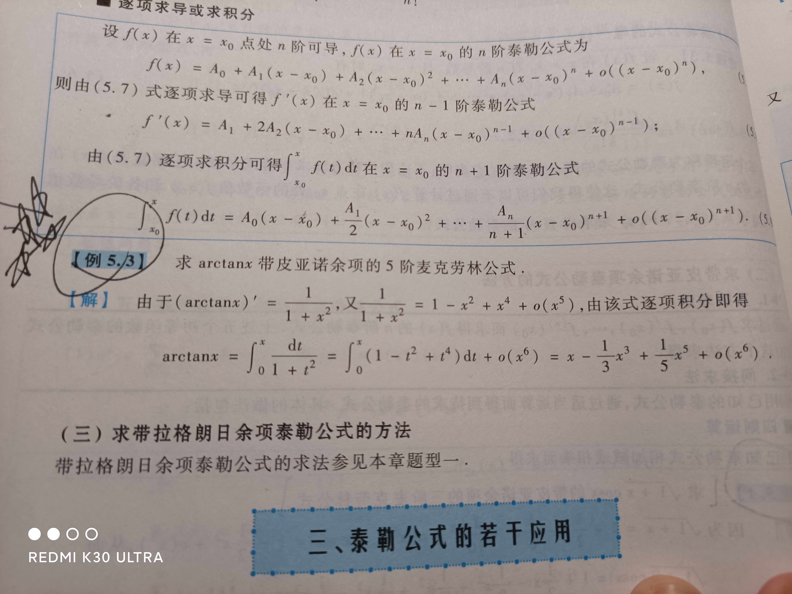
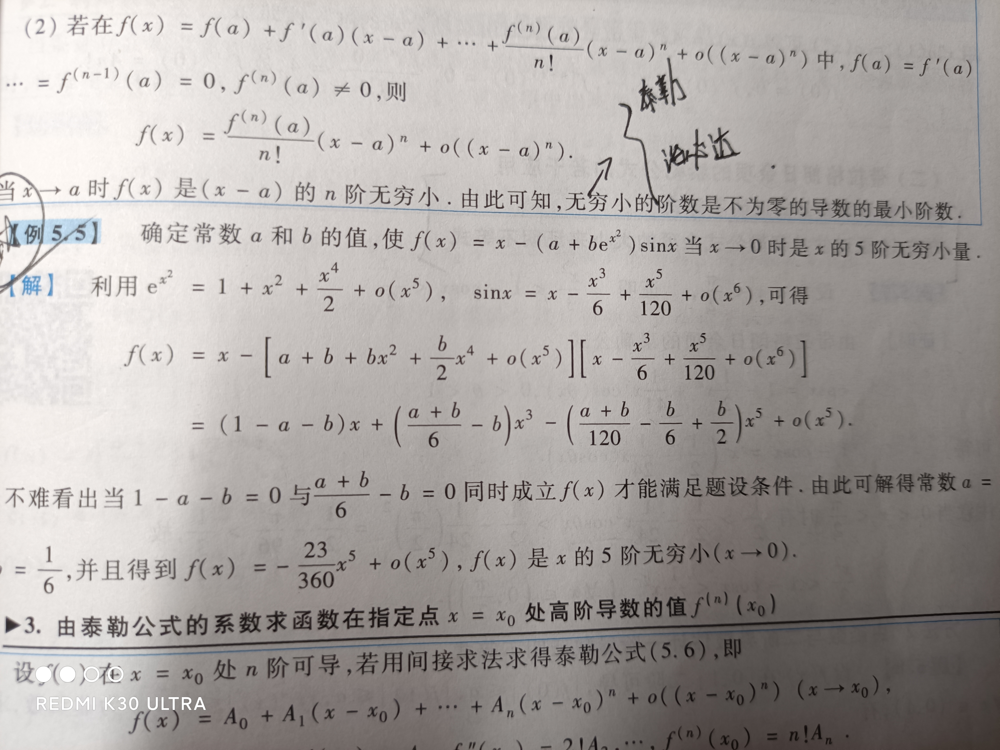

# 曲面的切平面与法线

# 曲线的切线与法平面

一元函数的泰勒公式

要是使用普通直接化泰勒，一定能求死人
该题使用了先求导在积分的方法

该题使用两种方法来求，1.泰勒，2.洛必达

多元函数的极限计算

多元函数的偏导数与全微分

多元函数的微分法则（求二阶偏导数）

多元函数的隐函数微分法

多元函数的极值问题与最值问题

梯度(向量)与方向导数(数值)

多元函数微分学的几何应用

# 函数与原函数

函数有T周期，则导函数也是T为周期(没有条件限制)
函数为周期T函数，则原函数不一定为周期T，不如f(x)=1，x=n周期1，原函数F(x)=x没有周期

# 极值点与驻点的定义与区别

极值点不一定是驻点，驻点也不一定是极值点
驻点：求导为0
极值点：求导为0或者不存在(比如说0点左边负无穷右边正无穷)

有问题的题目：249，205

